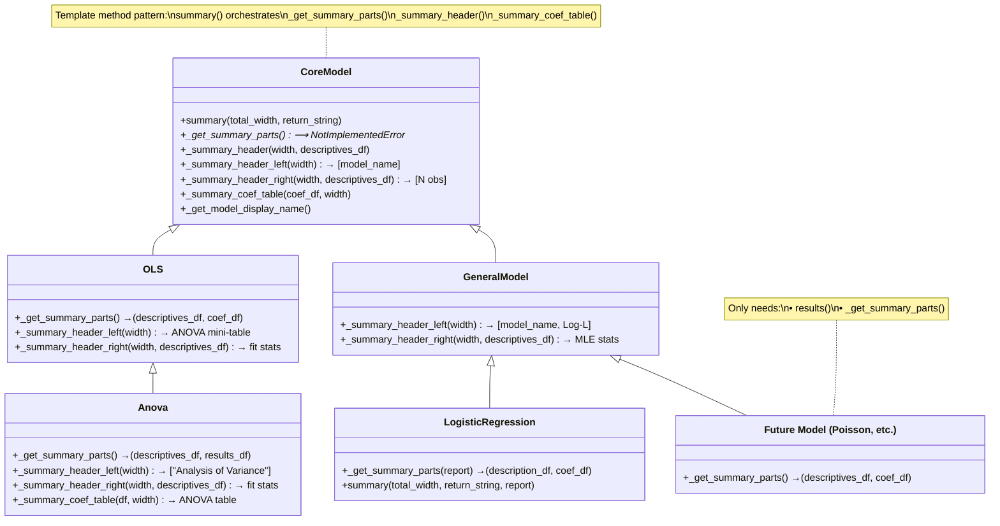
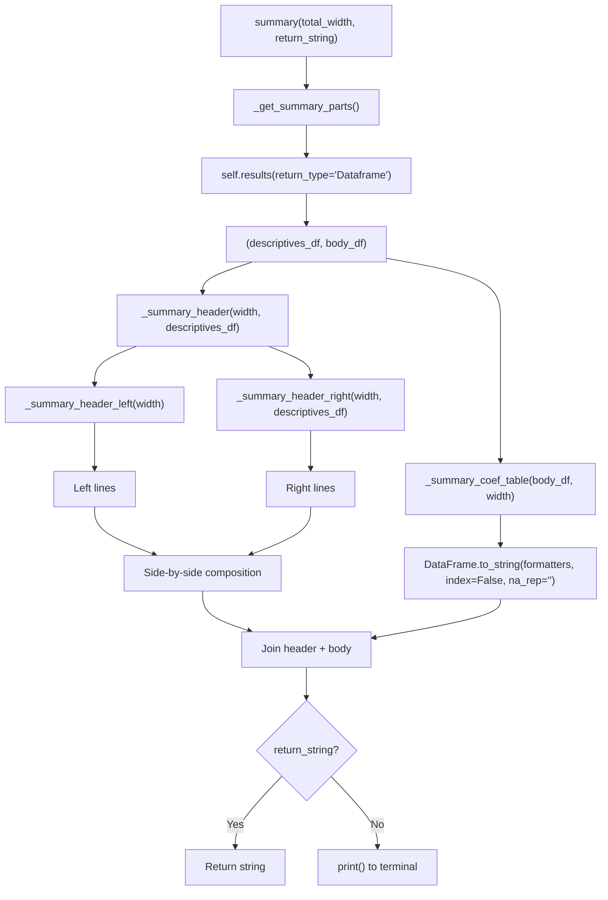

# `summary()` Architecture

## Class Hierarchy & Method Resolution



## Data Flow



## Summary Output Structure

```
┌─────────────────────────────────────────────────────────────────────────────┐
│ HEADER                                                                      │
│ ┌──────────────────────────────┐  ┌────────────────────────────────────────┐│
│ │ LEFT SIDE                    │  │ RIGHT SIDE                            ││
│ │ _summary_header_left()       │  │ _summary_header_right(descriptives_df)││
│ │                              │  │                                        ││
│ │ OLS:   Model name            │  │ OLS:   Number of obs, F, Prob>F,      ││
│ │        Source | SS  df  MS   │  │        R², Adj R², Root MSE           ││
│ │        ───────+──────────    │  │                                        ││
│ │        Model  | ... ... ...  │  │ Anova: Number of obs, F, Prob>F,      ││
│ │        Resid  | ... ... ...  │  │        R², Adj R², Root MSE           ││
│ │        Total  | ... ... ...  │  │                                        ││
│ │                              │  │ Logistic: N obs, LR Chi², Prob>Chi²   ││
│ │ Anova: "Analysis of Variance"│  │                                        ││
│ │                              │  │                                        ││
│ │ Logistic: Model name         │  │                                        ││
│ │           Log likelihood     │  │                                        ││
│ └──────────────────────────────┘  └────────────────────────────────────────┘│
├─────────────────────────────────────────────────────────────────────────────┤
│ BODY — _summary_coef_table(body_df, width)                                  │
│                                                                             │
│ OLS / Logistic (from CoreModel):                                            │
│ ──────────────────────────────────────────────────                           │
│          y   Coef.  Std. Err.     t  p-value  CI lower  CI upper            │
│  Intercept  0.5200    0.1234  4.21   0.0001      0.28      0.76            │
│      group                                                                  │
│          A  (reference)                                                     │
│          B  -0.3100   0.2345 -1.32   0.1870     -0.77      0.15            │
│         x1   0.1200   0.0567  2.12   0.0342      0.01      0.23            │
│ ──────────────────────────────────────────────────                           │
│                                                                             │
│ Anova (overrides _summary_coef_table):                                      │
│ ──────────────────────────────────────────────────                           │
│   Source       SS  df      MS      F  p-value  Eta²   Eps²  Omega²          │
│    Model   24.55   3  8.1833 0.1887   0.9026 0.0342 -0.15  -0.14          │
│    group   24.55   3  8.1833 0.1887   0.9026 0.0342 -0.14  -0.14          │
│ Residual  694.00  16 43.3750                                                │
│    Total  718.55  19 37.8184                                                │
│ ──────────────────────────────────────────────────                           │
│ Note: Effect size values for factors are partial.                            │
└─────────────────────────────────────────────────────────────────────────────┘
```

## Method Override Matrix

| Method | CoreModel | OLS | Anova | GeneralModel | LogisticRegression |
|--------|-----------|-----|-------|--------------|-------------------|
| `summary()` | ✅ Template | inherited | inherited | inherited | ✅ Adds `report` kwarg (delegates to `super()`) |
| `_get_summary_parts()` | ❌ `NotImplementedError` | ✅ | ✅ | ❌ (no `results()`) | ✅ |
| `_summary_header()` | ✅ Composes L+R | inherited | inherited | inherited | inherited |
| `_summary_header_left()` | ✅ `[model_name]` | ✅ ANOVA table | ✅ `[model_name]` (skips OLS table) | ✅ `[name, Log-L]` | inherited |
| `_summary_header_right()` | ✅ `[N obs]` | ✅ fit stats (uses `_splice_f_stat_lines`) | ✅ fit stats (uses `_splice_f_stat_lines`) | ✅ MLE stats | inherited |
| `_splice_f_stat_lines()` | — | ✅ Shared F/Prob helper | inherited | — | — |
| `_summary_coef_table()` | ✅ `to_string()` | inherited | ✅ ANOVA table | inherited | inherited |
| `_fmt_float()` | ✅ static | inherited | inherited | inherited | inherited |
| `_fmt_int()` | ✅ static | inherited | inherited | inherited | inherited |
| `_fmt_str()` | ✅ static | inherited | inherited | inherited | inherited |
| `_fmt_beta()` | ✅ static | inherited | inherited | inherited | inherited |

**Key:** ✅ = defined/overridden in this class · inherited = uses parent's version · ❌ = abstract/not available

## Adding a New Model Type

To add `summary()` support to a new model (e.g., Poisson regression):

```python
class PoissonRegression(GeneralModel):

    def results(self, return_type="Dataframe", ...):
        # ... build and return (meta_df, description_df, coef_df) ...

    def _get_summary_parts(self):
        """Wire results() into the summary() template."""
        import io, contextlib
        with contextlib.redirect_stdout(io.StringIO()):
            _meta, description_df, coef_df = self.results(
                return_type="Dataframe", pretty_format=True
            )
        return description_df, coef_df
```

That's it. Everything else — `summary()`, `_summary_header()`, `_summary_header_left()`,
`_summary_header_right()`, and `_summary_coef_table()` — is inherited automatically.

### Optional customization hooks

| Want to customize... | Override... |
|---|---|
| Header left side (model-specific info) | `_summary_header_left(width)` |
| Header right side (fit statistics) | `_summary_header_right(width, descriptives_df)` |
| Body table (different columns/format) | `_summary_coef_table(body_df, width)` |
| Extra `summary()` parameters | `summary()` with custom kwargs → call `_get_summary_parts()` |

## Design Principles

1. **Template Method Pattern** — `CoreModel.summary()` is the fixed skeleton; subclasses customize via hooks
2. **DataFrame-Driven** — All formatting reads from DataFrames returned by `results()`, not raw `self.model_data`
3. **`to_string()` for formatting** — Uses `DataFrame.to_string(formatters=..., index=False, na_rep="")` instead of manual string building
4. **No redundancy** — Header composition logic exists once in `CoreModel._summary_header()`; subclasses only override the content (left/right lines)
5. **Side-effect isolation** — `_get_summary_parts()` wraps `results()` with `contextlib.redirect_stdout` to suppress any print side-effects

